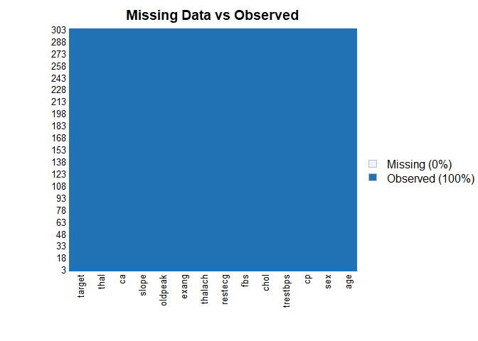

Heart Disease UCI - Logistic Regression
================
Dany Park
11/02/2021

# Logistic Regression and Prediction of Heart Disease

The project is to apply logistic regression to the heart disease
datatset and apply the fitted model to predict the potential patient.

## 1. Overview of Logistic Regression

Consider a dataset with the response variable(Y) falls into two
categories. Logistic regression is a statistical model that focuses on
the probability of each Y variable’s class given values of the
independent variables(X). Since the model is based on the probability,
at any given X value, the result has to fall between 0 and 1.
Mathematically speaking, 0 ≤ P(X) ≤ 1. The value of P(X) should always
produce the outputs within the range.


The regression is fitted using the maximum likelihood method because of
its statistical properties. The method estimates the model’s
coefficients such that the predicted probability corresponds as closely
as possible to the individual’s observations. In other words, predicted
β0 and β1 are found such that plugging these estimates into p(X), yields
a number close to one for all individuals who defaulted, and a number
close to zero for all individuals who did not¹.

## 2. The Dataset

The original
[dataset](https://archive.ics.uci.edu/ml/datasets/Heart+Disease) from
UCI contained 76 attributes which represent a patient’s condition. The
dataset for this article is from [Kaggle - Heart Disease
UCI](https://www.kaggle.com/ronitf/heart-disease-uci). The subset of 14
attributes with every incident represents a patient.

| Attribute |                     Description                     |
|:---------:|:---------------------------------------------------:|
|  target   |   Patients with heart disease, Response variable    |
|    age    |                   Age of patients                   |
|    sex    |                 Gender of patients                  |
|    cp     |             chest pain type (4 values)              |
| trestbps  |               resting blood pressure                |
|    sr     |             serum cholestoral in mg/dl              |
|    fbs    |         fasting blood sugar &gt; 120 mg/dl          |
|  restang  | resting electrocardiographic results (values 0,1,2) |
|    hr     |             maximum heart rate achieved             |
|   exang   |               exercise induced angina               |
|  oldpeak  | ST depression induced by exercise relative to rest  |
|   slope   |      the slope of the peak exercise ST segment      |
|    fbs    | number of major vessels (0-3) colored by flourosopy |
|   thal    | 3 = normal; 6 = fixed defect; 7 = reversable defect |

The data is imported from the local device and printed summary of the
dataframe to get the overview.

``` r
#import dataframe: csv
df<-read.csv("heart.csv", header =TRUE)
summary(df)
```

    ##      ï..age           sex               cp           trestbps    
    ##  Min.   :29.00   Min.   :0.0000   Min.   :0.000   Min.   : 94.0  
    ##  1st Qu.:47.50   1st Qu.:0.0000   1st Qu.:0.000   1st Qu.:120.0  
    ##  Median :55.00   Median :1.0000   Median :1.000   Median :130.0  
    ##  Mean   :54.37   Mean   :0.6832   Mean   :0.967   Mean   :131.6  
    ##  3rd Qu.:61.00   3rd Qu.:1.0000   3rd Qu.:2.000   3rd Qu.:140.0  
    ##  Max.   :77.00   Max.   :1.0000   Max.   :3.000   Max.   :200.0  
    ##       chol            fbs            restecg          thalach     
    ##  Min.   :126.0   Min.   :0.0000   Min.   :0.0000   Min.   : 71.0  
    ##  1st Qu.:211.0   1st Qu.:0.0000   1st Qu.:0.0000   1st Qu.:133.5  
    ##  Median :240.0   Median :0.0000   Median :1.0000   Median :153.0  
    ##  Mean   :246.3   Mean   :0.1485   Mean   :0.5281   Mean   :149.6  
    ##  3rd Qu.:274.5   3rd Qu.:0.0000   3rd Qu.:1.0000   3rd Qu.:166.0  
    ##  Max.   :564.0   Max.   :1.0000   Max.   :2.0000   Max.   :202.0  
    ##      exang           oldpeak         slope             ca        
    ##  Min.   :0.0000   Min.   :0.00   Min.   :0.000   Min.   :0.0000  
    ##  1st Qu.:0.0000   1st Qu.:0.00   1st Qu.:1.000   1st Qu.:0.0000  
    ##  Median :0.0000   Median :0.80   Median :1.000   Median :0.0000  
    ##  Mean   :0.3267   Mean   :1.04   Mean   :1.399   Mean   :0.7294  
    ##  3rd Qu.:1.0000   3rd Qu.:1.60   3rd Qu.:2.000   3rd Qu.:1.0000  
    ##  Max.   :1.0000   Max.   :6.20   Max.   :2.000   Max.   :4.0000  
    ##       thal           target      
    ##  Min.   :0.000   Min.   :0.0000  
    ##  1st Qu.:2.000   1st Qu.:0.0000  
    ##  Median :2.000   Median :1.0000  
    ##  Mean   :2.314   Mean   :0.5446  
    ##  3rd Qu.:3.000   3rd Qu.:1.0000  
    ##  Max.   :3.000   Max.   :1.0000

``` r
head(df,5)
```

    ##   ï..age sex cp trestbps chol fbs restecg thalach exang oldpeak slope ca thal
    ## 1     63   1  3      145  233   1       0     150     0     2.3     0  0    1
    ## 2     37   1  2      130  250   0       1     187     0     3.5     0  0    2
    ## 3     41   0  1      130  204   0       0     172     0     1.4     2  0    2
    ## 4     56   1  1      120  236   0       1     178     0     0.8     2  0    2
    ## 5     57   0  0      120  354   0       1     163     1     0.6     2  0    2
    ##   target
    ## 1      1
    ## 2      1
    ## 3      1
    ## 4      1
    ## 5      1

The dataset has total of 14 attributes and 303 incidences. Of those,
`sex`, `cp`, `fbs`, `restecg`, `exang`, `slope`, `thal` and `target` are
the characterized as categorical variable. The rest, `age`, `trestbps`,
`chol`, `thalach` and `oldpeak`, are the continuous variable. However,
before we proceed, there’s an erronous attribute: `ï..age`. It is
corrected to `age`.

``` r
#change erronous attribute name:  ï..age
colnames(df)[colnames(df)=='ï..age'] <-'age'
head(df,5)
```

    ##   age sex cp trestbps chol fbs restecg thalach exang oldpeak slope ca thal
    ## 1  63   1  3      145  233   1       0     150     0     2.3     0  0    1
    ## 2  37   1  2      130  250   0       1     187     0     3.5     0  0    2
    ## 3  41   0  1      130  204   0       0     172     0     1.4     2  0    2
    ## 4  56   1  1      120  236   0       1     178     0     0.8     2  0    2
    ## 5  57   0  0      120  354   0       1     163     1     0.6     2  0    2
    ##   target
    ## 1      1
    ## 2      1
    ## 3      1
    ## 4      1
    ## 5      1

Most of the time, the categorical variable in the dataframe requires to
be coverted to the factor type in Rstudio. Initially, all the variables
were categorized as integer. Before analyze the data, categorical
variables must be converted from int to factor. The code `as.factor` is
used to successfully convert. As shown below, the result between the
first `str` and the second run are different. In fact, the second `str`
overrided the type accordingly.

``` r
#check the type of each attribute and change to factor or int
str(df)
```

    ## 'data.frame':    303 obs. of  14 variables:
    ##  $ age     : int  63 37 41 56 57 57 56 44 52 57 ...
    ##  $ sex     : int  1 1 0 1 0 1 0 1 1 1 ...
    ##  $ cp      : int  3 2 1 1 0 0 1 1 2 2 ...
    ##  $ trestbps: int  145 130 130 120 120 140 140 120 172 150 ...
    ##  $ chol    : int  233 250 204 236 354 192 294 263 199 168 ...
    ##  $ fbs     : int  1 0 0 0 0 0 0 0 1 0 ...
    ##  $ restecg : int  0 1 0 1 1 1 0 1 1 1 ...
    ##  $ thalach : int  150 187 172 178 163 148 153 173 162 174 ...
    ##  $ exang   : int  0 0 0 0 1 0 0 0 0 0 ...
    ##  $ oldpeak : num  2.3 3.5 1.4 0.8 0.6 0.4 1.3 0 0.5 1.6 ...
    ##  $ slope   : int  0 0 2 2 2 1 1 2 2 2 ...
    ##  $ ca      : int  0 0 0 0 0 0 0 0 0 0 ...
    ##  $ thal    : int  1 2 2 2 2 1 2 3 3 2 ...
    ##  $ target  : int  1 1 1 1 1 1 1 1 1 1 ...

``` r
df$sex <- as.factor(df$sex)
df$cp <- as.factor(df$cp)
df$fbs <- as.factor(df$fbs)
df$restecg <- as.factor(df$restecg)
df$exang <- as.factor(df$exang)
df$slope <- as.factor(df$slope)
df$thal <- as.factor(df$thal)

str(df) #re-run
```

    ## 'data.frame':    303 obs. of  14 variables:
    ##  $ age     : int  63 37 41 56 57 57 56 44 52 57 ...
    ##  $ sex     : Factor w/ 2 levels "0","1": 2 2 1 2 1 2 1 2 2 2 ...
    ##  $ cp      : Factor w/ 4 levels "0","1","2","3": 4 3 2 2 1 1 2 2 3 3 ...
    ##  $ trestbps: int  145 130 130 120 120 140 140 120 172 150 ...
    ##  $ chol    : int  233 250 204 236 354 192 294 263 199 168 ...
    ##  $ fbs     : Factor w/ 2 levels "0","1": 2 1 1 1 1 1 1 1 2 1 ...
    ##  $ restecg : Factor w/ 3 levels "0","1","2": 1 2 1 2 2 2 1 2 2 2 ...
    ##  $ thalach : int  150 187 172 178 163 148 153 173 162 174 ...
    ##  $ exang   : Factor w/ 2 levels "0","1": 1 1 1 1 2 1 1 1 1 1 ...
    ##  $ oldpeak : num  2.3 3.5 1.4 0.8 0.6 0.4 1.3 0 0.5 1.6 ...
    ##  $ slope   : Factor w/ 3 levels "0","1","2": 1 1 3 3 3 2 2 3 3 3 ...
    ##  $ ca      : int  0 0 0 0 0 0 0 0 0 0 ...
    ##  $ thal    : Factor w/ 4 levels "0","1","2","3": 2 3 3 3 3 2 3 4 4 3 ...
    ##  $ target  : int  1 1 1 1 1 1 1 1 1 1 ...

One of the most important step in data analysis is dealing with the
missing data. Usually, the complete dataset doesn’t take place in the
industry level. The code `missmap` is the perfect tool to visualize the
missing data in each attribute. Luckily, the graph suggests that there
isn’t any missing data for this dataframe.

``` r
#check for any missing data
library(Amelia)
```

    ## Loading required package: Rcpp

    ## ## 
    ## ## Amelia II: Multiple Imputation
    ## ## (Version 1.7.6, built: 2019-11-24)
    ## ## Copyright (C) 2005-2021 James Honaker, Gary King and Matthew Blackwell
    ## ## Refer to http://gking.harvard.edu/amelia/ for more information
    ## ##

``` r
missmap(df, main = "Missing Data vs Observed")
```

<!-- -->

The final step before analyze the data is checking the ratio of the
categories in the response variable. Resampling method can resolve the
high inbalance between the classification. However, below result
provides that the imbalance isn’t significant enough to apply
under/over-sampling algorithm.

``` r
#check the ratio of reponse variable and see if it requires to rebalance
library(plyr)
count(df,vars="target")
```

    ##   target freq
    ## 1      0  138
    ## 2      1  165

## 3. Data Visualization

Before

``` r
#Data Visualization
library(GGally)
```

    ## Loading required package: ggplot2

    ## Registered S3 method overwritten by 'GGally':
    ##   method from   
    ##   +.gg   ggplot2

``` r
library(ggsci)
```

``` r
#1. Count of Target variable
ggplot(df, aes(factor(target), fill=factor(target)))+
  geom_bar(stat="count", width=0.5, color="black")+
  ggtitle("Count of Target")+xlab("Target")+ylab("Count")+labs(fill="Target")+
  theme_bw()+
  scale_fill_npg()
```

<!-- -->

``` r
#2. Barplot of Gender broken down by Target
ggplot(df, aes(sex, fill=factor(target)))+
  geom_bar(stat="count", width=0.5, color="black", position=position_dodge())+
  ggtitle("Gender of Patient, Broken by Target")+xlab("Gender")+ylab("Count")+labs(fill="Target")+
  theme_bw()+
  scale_fill_npg()
```

<!-- -->

``` r
#3. Barplot for categorical variables broken down by Target
cat_var <- c("sex", "cp", "fbs", "restecg", "exang", "slope", "thal", "target")
cat_df <- df[cat_var]

for(i in 1:7){
  print(ggplot(cat_df, aes(x=cat_df[,i], fill=factor(target)))+
    geom_bar(stat="count", width=0.5, color="black", position=position_dodge())+
    ggtitle(paste(colnames(cat_df)[i], ": Broken by Target"))+
    xlab(colnames(cat_df)[i])+ylab("Count")+labs(fill="Target")+
    theme_bw()+
    scale_fill_npg())
}
```

<!-- --><!-- --><!-- --><!-- --><!-- --><!-- --><!-- -->

``` r
library(ggpubr)
```

    ## 
    ## Attaching package: 'ggpubr'

    ## The following object is masked from 'package:plyr':
    ## 
    ##     mutate

``` r
#4. Age distribution by Target
mp <- ggplot(df, aes(sex, age, fill=factor(target)))+
  geom_boxplot(width=0.5)+
  ggtitle("Distribution of Age, by Gender", subtitle="")+xlab("Gender")+ylab("Age")+labs(fill="Target")+
  theme_bw()+
  scale_fill_npg()
#4-1. subplots
xplot <- ggplot(df, aes(sex, fill=factor(target)))+
  geom_bar(stat="count", width=0.5, alpha=0.4,color="black", position=position_dodge())+
  labs(fill="Target")+
  theme_bw()+
  scale_fill_npg()
yplot <- ggplot(df, aes(age, fill=factor(target)))+
  geom_density(alpha=0.4)+
  labs(fill="Target")+
  theme_bw()+
  scale_fill_npg()+
  rotate()
#4-2. combination
library(ggpubr)
ggarrange(xplot, NULL, mp, yplot,
          ncol =2, nrow=2, align = "hv",
          widths= c(3,1), heights = c(1,2),
          common.legend= TRUE)
```

<!-- -->

``` r
#5. Boxplot for continuous variables broken down by Target
cont_var <- c("age", "trestbps", "chol", "thalach", "oldpeak", "target")
cont_df <- df[cont_var]

for(i in 1:5){
  print(ggplot(cont_df, aes(x=cont_df[,i], y=factor(target), fill=factor(target)))+
          geom_boxplot(width=0.5)+
          geom_point(position=position_dodge(width=0.5), alpha=0.2)+
          ggtitle(paste(colnames(cont_df)[i], ": Broken by Target"))+
          xlab(colnames(cont_df)[i])+ylab("Target")+labs(fill="Target")+
          theme_bw()+
          scale_fill_npg())
}
```

<!-- --><!-- --><!-- --><!-- --><!-- -->

## 4. Logistic Regression

In the beginning of this notebook, the concept of the logistic
regression was studied. Unlike the linear regression, the classification
method apply accuracy, precision, F1 score and related indicators to
measure the validty of the model. Splitting the entire dataframe between
the train and test sets are essential to avoid biased results. The
`train_df` is used only to study and determine the appropriate model.
For this study, the split of dataframe between train and test sets
conducted with the ratio of 4:1. It is important to ramdomly allocate
the incidences between the data sets. First `set.seed` will ramdomize
the incidences in the frame, followed by the division. Once the
statistical model is discovered and validated, the same model will be
used to

``` r
#Train,Test Split
library(caTools)
set.seed(1234)
sample <- sample.split(df, SplitRatio = 0.75) #Randomly set identifier
train_df <- subset(df, sample==TRUE) #Train dataset
test_df  <- subset(df, sample==FALSE) #Test dataset
```

#### 4-1. Fitting the model

Discovering the statistically siginificant variable is extremely
difficult just by the help of data visualization. The `train_df` is
applied to the logistic regression. As our response variable consists
only two categories, the binomial distribution is chosen as the `family`
in `glm`. The summary of the first model indicates the AIC score of
171.97 with the 197 degress of freedom. The coefficient gives the
insight of full model of logistic regression. In the sumamry the right
most column is the P-value of each coefficient in the model. The more
they are statistically sigificant, more codes appear on the right side.

``` r
#Logistic Regression: full fitting with train dataset
df_model <- glm(target~., data=train_df, family=binomial(link="logit"))
print(df_model$coefficents)
```

    ## NULL

``` r
summary(df_model)
```

    ## 
    ## Call:
    ## glm(formula = target ~ ., family = binomial(link = "logit"), 
    ##     data = train_df)
    ## 
    ## Deviance Residuals: 
    ##     Min       1Q   Median       3Q      Max  
    ## -2.7487  -0.2894   0.1013   0.4459   2.0476  
    ## 
    ## Coefficients:
    ##               Estimate Std. Error z value Pr(>|z|)    
    ## (Intercept)  7.986e-01  4.389e+00   0.182 0.855602    
    ## age          1.026e-02  2.876e-02   0.357 0.721248    
    ## sex1        -2.079e+00  6.880e-01  -3.021 0.002516 ** 
    ## cp1          1.189e+00  7.134e-01   1.667 0.095471 .  
    ## cp2          2.202e+00  6.491e-01   3.392 0.000693 ***
    ## cp3          2.087e+00  8.327e-01   2.507 0.012184 *  
    ## trestbps    -2.364e-02  1.396e-02  -1.693 0.090431 .  
    ## chol        -7.693e-03  4.749e-03  -1.620 0.105270    
    ## fbs1        -3.429e-01  7.214e-01  -0.475 0.634565    
    ## restecg1    -3.863e-01  4.672e-01  -0.827 0.408285    
    ## restecg2    -1.342e+01  1.263e+03  -0.011 0.991522    
    ## thalach      3.363e-02  1.444e-02   2.329 0.019863 *  
    ## exang1      -4.884e-01  5.446e-01  -0.897 0.369839    
    ## oldpeak     -4.963e-01  2.844e-01  -1.745 0.080988 .  
    ## slope1      -1.056e+00  9.937e-01  -1.062 0.288068    
    ## slope2       1.409e-01  1.109e+00   0.127 0.898965    
    ## ca          -1.477e+00  3.320e-01  -4.448 8.67e-06 ***
    ## thal1        2.198e+00  3.281e+00   0.670 0.502842    
    ## thal2        1.906e+00  3.191e+00   0.597 0.550204    
    ## thal3        4.813e-01  3.206e+00   0.150 0.880662    
    ## ---
    ## Signif. codes:  0 '***' 0.001 '**' 0.01 '*' 0.05 '.' 0.1 ' ' 1
    ## 
    ## (Dispersion parameter for binomial family taken to be 1)
    ## 
    ##     Null deviance: 299.16  on 216  degrees of freedom
    ## Residual deviance: 131.97  on 197  degrees of freedom
    ## AIC: 171.97
    ## 
    ## Number of Fisher Scoring iterations: 15

The result above inidcates that the variables, `sex`, `cp`, `trestbps`,
`thalach`, `oldpeak` and `ca`, are statistically significant. The model
is reduced by fitting only important variables. The summary below is the
fitted model of only significant variables. The AIC score of 171.89 with
the degrees of freedom of 206. The reduced model has lower AIC score
which suggests that it is better fitted than the full model. However,
before using the reduced model, the ANOVA test is conducted to prove the
significance of difference.

``` r
#create a model with the statistically siginifcant variables only
df_model.part <- glm(target~sex+cp+trestbps+thalach+oldpeak+ca, data=train_df, family=binomial(link="logit"))
summary(df_model.part)
```

    ## 
    ## Call:
    ## glm(formula = target ~ sex + cp + trestbps + thalach + oldpeak + 
    ##     ca, family = binomial(link = "logit"), data = train_df)
    ## 
    ## Deviance Residuals: 
    ##     Min       1Q   Median       3Q      Max  
    ## -2.3237  -0.3944   0.1722   0.5425   2.0476  
    ## 
    ## Coefficients:
    ##             Estimate Std. Error z value Pr(>|z|)    
    ## (Intercept) -0.81746    2.26757  -0.361 0.718471    
    ## sex1        -2.07054    0.50221  -4.123 3.74e-05 ***
    ## cp1          1.72775    0.63360   2.727 0.006393 ** 
    ## cp2          2.19004    0.53253   4.113 3.91e-05 ***
    ## cp3          2.57576    0.75145   3.428 0.000609 ***
    ## trestbps    -0.02275    0.01267  -1.796 0.072536 .  
    ## thalach      0.03790    0.01124   3.371 0.000749 ***
    ## oldpeak     -0.73794    0.23016  -3.206 0.001345 ** 
    ## ca          -1.15836    0.26687  -4.341 1.42e-05 ***
    ## ---
    ## Signif. codes:  0 '***' 0.001 '**' 0.01 '*' 0.05 '.' 0.1 ' ' 1
    ## 
    ## (Dispersion parameter for binomial family taken to be 1)
    ## 
    ##     Null deviance: 299.16  on 216  degrees of freedom
    ## Residual deviance: 153.89  on 208  degrees of freedom
    ## AIC: 171.89
    ## 
    ## Number of Fisher Scoring iterations: 6

``` r
print(df_model.part$aic - df_model$aic) #difference of AIC score
```

    ## [1] -0.07491292

``` r
#validate that the reduced model is statistically siginifcant over the full model
anova(df_model.part, df_model, test="Chisq")
```

    ## Analysis of Deviance Table
    ## 
    ## Model 1: target ~ sex + cp + trestbps + thalach + oldpeak + ca
    ## Model 2: target ~ age + sex + cp + trestbps + chol + fbs + restecg + thalach + 
    ##     exang + oldpeak + slope + ca + thal
    ##   Resid. Df Resid. Dev Df Deviance Pr(>Chi)  
    ## 1       208     153.90                       
    ## 2       197     131.97 11   21.925  0.02496 *
    ## ---
    ## Signif. codes:  0 '***' 0.001 '**' 0.01 '*' 0.05 '.' 0.1 ' ' 1

``` r
#ROC and AUC for the partial model
library(pROC)
```

    ## Type 'citation("pROC")' for a citation.

    ## 
    ## Attaching package: 'pROC'

    ## The following objects are masked from 'package:stats':
    ## 
    ##     cov, smooth, var

``` r
par(pty="s")
roc(train_df$target, df_model.part$fitted.values, plot=TRUE, legacy.axes=TRUE,
    col="Red", print.auc = TRUE, print.auc.x=0.35,
    xlab="False Positive Rate",
    ylab="True Positive Rate")
```

    ## Setting levels: control = 0, case = 1

    ## Setting direction: controls < cases

<!-- -->

    ## 
    ## Call:
    ## roc.default(response = train_df$target, predictor = df_model.part$fitted.values,     plot = TRUE, legacy.axes = TRUE, col = "Red", print.auc = TRUE,     print.auc.x = 0.35, xlab = "False Positive Rate", ylab = "True Positive Rate")
    ## 
    ## Data: df_model.part$fitted.values in 99 controls (train_df$target 0) < 118 cases (train_df$target 1).
    ## Area under the curve: 0.9199

``` r
#Fiiting the model to test dataset and Confusion Matrix of the fitted model
df_model_fit <- predict(df_model.part, newdata=test_df, type="response")
df_model_confmat <- ifelse(df_model_fit >0.5, 1, 0)

library(caret)
```

    ## Loading required package: lattice

``` r
confusionMatrix(factor(df_model_confmat), factor(test_df$target), positive=as.character(1))
```

    ## Confusion Matrix and Statistics
    ## 
    ##           Reference
    ## Prediction  0  1
    ##          0 31 11
    ##          1  8 36
    ##                                           
    ##                Accuracy : 0.7791          
    ##                  95% CI : (0.6767, 0.8614)
    ##     No Information Rate : 0.5465          
    ##     P-Value [Acc > NIR] : 6.351e-06       
    ##                                           
    ##                   Kappa : 0.5572          
    ##                                           
    ##  Mcnemar's Test P-Value : 0.6464          
    ##                                           
    ##             Sensitivity : 0.7660          
    ##             Specificity : 0.7949          
    ##          Pos Pred Value : 0.8182          
    ##          Neg Pred Value : 0.7381          
    ##              Prevalence : 0.5465          
    ##          Detection Rate : 0.4186          
    ##    Detection Prevalence : 0.5116          
    ##       Balanced Accuracy : 0.7804          
    ##                                           
    ##        'Positive' Class : 1               
    ## 
